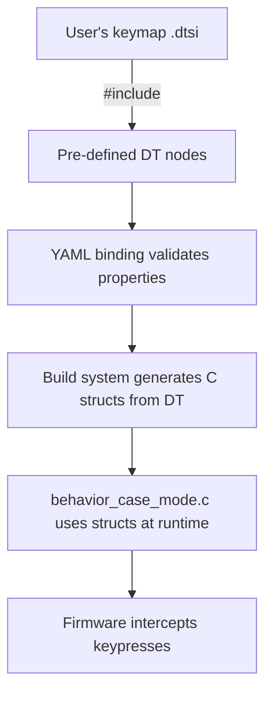
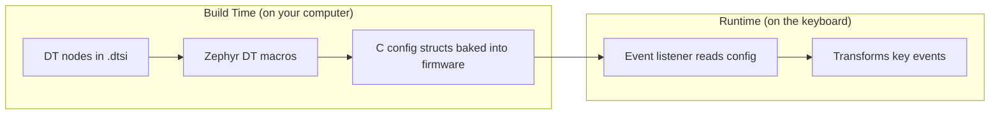
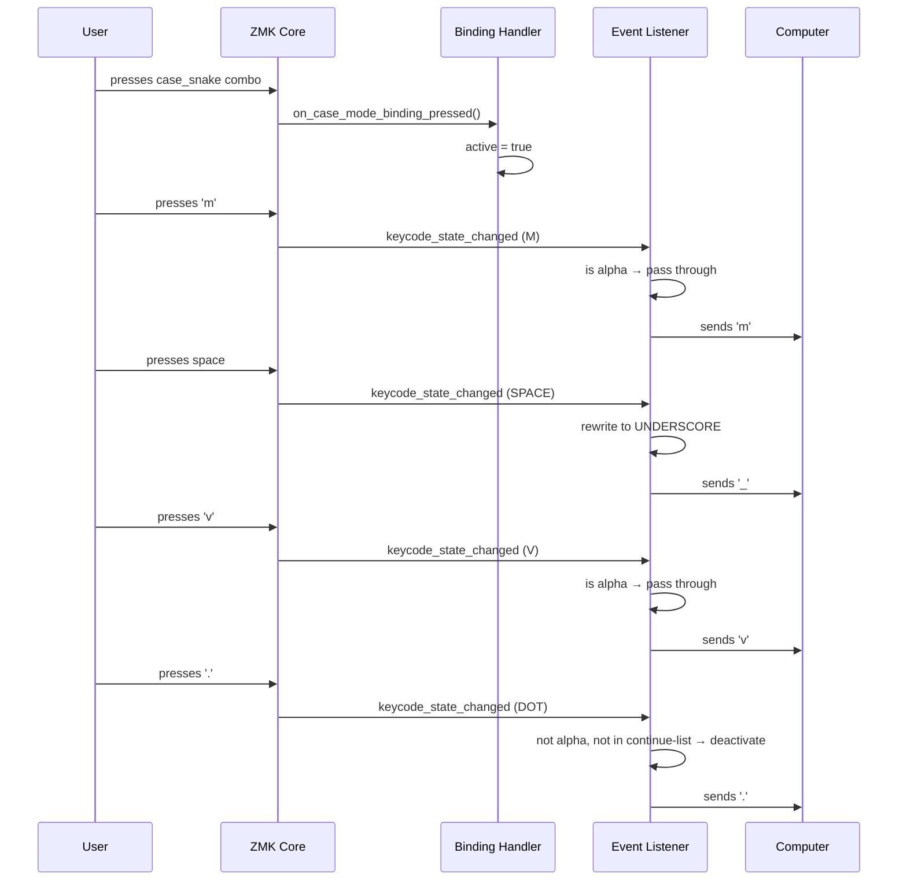

# Architecture Overview

This document explains how the zmk-case-mode module is structured and how the pieces fit together.

## Project Structure

```
zmk-case-mode/
├── zephyr/module.yml                        ← "I'm a ZMK module"
├── CMakeLists.txt                           ← which .c files to compile
├── Kconfig                                  ← auto-enable when DT uses us
├── dts/
│   ├── bindings/behaviors/
│   │   └── zmk,behavior-case-mode.yaml      ← property schema (validation)
│   └── behaviors/
│       └── case_mode.dtsi                   ← pre-defined instances
└── src/behaviors/
    └── behavior_case_mode.c                 ← the actual logic
```

## How It All Connects



## The Three Layers

| Layer  | File                          | Role                              | When                         |
| ------ | ----------------------------- | --------------------------------- | ---------------------------- |
| Schema | `zmk,behavior-case-mode.yaml` | Defines what properties are valid | Build time (validation)      |
| Config | `case_mode.dtsi`              | Concrete instances with values    | Build time (code generation) |
| Logic  | `behavior_case_mode.c`        | Reads config, transforms keys     | Runtime                      |

## Build-Time vs Runtime



**Build time**: your DT properties (`delimiter = <UNDERSCORE>`, `emit-delimiter`, etc.) get turned into a C struct. This is frozen — you can't change it without reflashing.

**Runtime**: the listener function reads that frozen config and uses it to decide what to do with each keypress.

## The Two Runtime Mechanisms

The module has exactly two things that run on the keyboard:

1. **The binding handler** — runs when you press the key bound to `&case_snake` (or whichever). Toggles `active` on/off.

2. **The event listener** — runs on EVERY keypress on the entire keyboard. Checks if any case-mode is active, and if so, transforms or blocks the key event.



Result on screen: `m_v.` — case mode was active for `m_v`, then `.` ended it and passed through normally.
