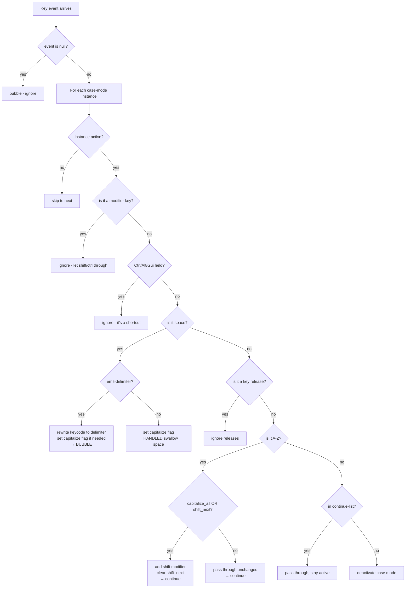

# Code Walkthrough

A line-by-line explanation of `src/behaviors/behavior_case_mode.c` for people who aren't deeply familiar with C or Zephyr.

## 1. The DT Compat Declaration

```c
#define DT_DRV_COMPAT zmk_behavior_case_mode
```

This single line connects the C file to the devicetree. It says: "when I use macros like `DT_INST_PROP(n, delimiter)`, I mean instances of `zmk,behavior-case-mode`."

Note: commas in the compatible string become underscores in C (`zmk,behavior-case-mode` → `zmk_behavior_case_mode`).

## 2. The Guard

```c
#if DT_HAS_COMPAT_STATUS_OKAY(DT_DRV_COMPAT)
...
#endif
```

"Only compile this code if at least one instance exists in the user's devicetree." If nobody uses any case-mode behavior, this entire file compiles to zero bytes. No wasted flash.

## 3. Data Structures

### The continue-list item

```c
struct case_mode_continue_item {
    uint16_t page;              // HID usage page (0x07 = keyboard)
    uint32_t id;                // HID keycode (e.g. 0x1E = key "1")
    uint8_t implicit_modifiers; // required mods (e.g. shift for "!")
};
```

A keycode in ZMK isn't just one number — it's three things combined. `UNDERSCORE` is really "the minus key + shift modifier on the keyboard page."

### The config (read-only, set at compile time)

```c
struct behavior_case_mode_config {
    uint8_t delimiter_keycode;          // what HID key to send on space
    uint8_t delimiter_mods;             // what modifiers to add
    bool emit_delimiter;                // send it or swallow space?
    bool capitalize_words;              // capitalize first letter of each word?
    bool capitalize_first;              // capitalize first letter on activation?
    bool capitalize_all;                // capitalize ALL letters?
    uint8_t continuations_count;        // how many items in continue-list
    struct case_mode_continue_item continuations[];  // the list itself
};
```

This struct is frozen into firmware. One per DT instance. You can't change it at runtime.

The `continuations[]` at the end is a "flexible array member" — it lets the struct have a variable-length array as its last field. The size is determined at compile time based on how many items are in your `continue-list`.

### The runtime state (changes as you type)

```c
struct behavior_case_mode_data {
    bool active;      // is this instance currently on?
    bool shift_next;  // should the next alpha key be capitalized?
};
```

Only two bits of state. That's it. The whole behavior is driven by these two booleans plus the frozen config.

## 4. The Device Array

```c
#define GET_DEV(inst) DEVICE_DT_INST_GET(inst),
static const struct device *devs[] = {DT_INST_FOREACH_STATUS_OKAY(GET_DEV)};
```

This creates a flat array of ALL case-mode instances. If you defined `case_snake`, `case_camel`, and `case_kebab`, this becomes:

```c
static const struct device *devs[] = { &snake_dev, &camel_dev, &kebab_dev };
```

We need this because the event listener must check ALL instances on every keypress — it doesn't know which one is active without looking.

## 5. Activate / Deactivate

```c
static void deactivate_case_mode(const struct device *dev) {
    data->active = false;
    data->shift_next = false;
}

static void activate_case_mode(const struct device *dev) {
    // Deactivate ALL instances first (mutual exclusion)
    for (int i = 0; i < ARRAY_SIZE(devs); i++) {
        deactivate_case_mode(devs[i]);
    }
    // Then activate this one
    data->active = true;
    data->shift_next = config->capitalize_first;
}
```

Key insight: `activate` deactivates everything first. This guarantees only one case mode is ever active. No conflicts.

For PascalCase, `capitalize_first` is true, so `shift_next` starts as true — the very first letter you type will be shifted.

## 6. The Binding Handler (Toggle)

```c
static int on_case_mode_binding_pressed(...) {
    if (data->active) {
        deactivate_case_mode(dev);
    } else {
        activate_case_mode(dev);
    }
    return ZMK_BEHAVIOR_OPAQUE;
}
```

This runs when you physically press the key/combo bound to a case-mode behavior. It's a simple toggle.

`ZMK_BEHAVIOR_OPAQUE` means "I consumed this keypress, don't send anything to the computer." The toggle key itself never produces output.

## 7. The Driver API

```c
static const struct behavior_driver_api behavior_case_mode_driver_api = {
    .binding_pressed = on_case_mode_binding_pressed,
    .binding_released = on_case_mode_binding_released,
};
```

This is ZMK's plugin interface — a table of function pointers. Think of it like implementing an interface in TypeScript:

```typescript
// Conceptually equivalent:
interface BehaviorDriver {
  bindingPressed: (binding, event) => number;
  bindingReleased: (binding, event) => number;
}
```

ZMK calls these when the behavior is triggered from a keymap binding.

## 8. The Event Listener Registration

```c
ZMK_LISTENER(behavior_case_mode, case_mode_keycode_state_changed_listener);
ZMK_SUBSCRIPTION(behavior_case_mode, zmk_keycode_state_changed);
```

This says: "every time ANY key on the keyboard is pressed or released, call my listener function."

This is different from the binding handler. The binding handler only runs when YOU press the case-mode key. The listener runs on EVERY key — it's a global observer.

## 9. Helper Functions

```c
case_mode_is_alpha()           // A-Z?
case_mode_is_space()           // spacebar?
case_mode_has_shortcut_mods()  // Ctrl/Alt/Gui held?
case_mode_is_in_continue_list() // in user's continue-list?
```

Simple boolean checks. The `has_shortcut_mods` one is important — if you press Ctrl+C while in snake_case mode, we don't want to interfere. It's a shortcut, not text.

## 10. The Main Listener (The Brain)

This is where all the magic happens. Here's the decision tree:



### The key mechanism: event mutation

We don't send new key events. We **rewrite the existing one**:

```c
// Space becomes underscore:
ev->keycode = config->delimiter_keycode;       // change "space" to "minus"
ev->implicit_modifiers = config->delimiter_mods; // add shift (minus+shift = underscore)
```

The computer never knows space was pressed. It only sees the underscore.

### Return values

| Return                 | Meaning                                           |
| ---------------------- | ------------------------------------------------- |
| `ZMK_EV_EVENT_BUBBLE`  | "Pass this event along (possibly modified by us)" |
| `ZMK_EV_EVENT_HANDLED` | "Swallow this event. The computer never sees it." |

- Space with `emit_delimiter=true` → BUBBLE (sends the rewritten delimiter)
- Space with `emit_delimiter=false` → HANDLED (camelCase swallows the space)
- Everything else → BUBBLE (pass through, modified or not)

## 11. The Macro Section (Code Generation)

This is the scariest-looking part but conceptually the simplest:

```c
#define CASE_MODE_INST(n) \
    /* create runtime state */ \
    static struct behavior_case_mode_data data_##n = { .active = false }; \
    /* create frozen config from DT properties */ \
    static const struct behavior_case_mode_config config_##n = { \
        .delimiter_keycode = ZMK_HID_USAGE_ID(DT_INST_PROP(n, delimiter)), \
        .delimiter_mods = SELECT_MODS(DT_INST_PROP(n, delimiter)), \
        .emit_delimiter = DT_INST_PROP(n, emit_delimiter), \
        .capitalize_words = DT_INST_PROP(n, capitalize_words), \
        ... \
    }; \
    /* register as a Zephyr device */ \
    BEHAVIOR_DT_INST_DEFINE(n, ...);

DT_INST_FOREACH_STATUS_OKAY(CASE_MODE_INST)
```

`DT_INST_FOREACH_STATUS_OKAY(CASE_MODE_INST)` means: "for each instance of `zmk,behavior-case-mode` in the devicetree, run the `CASE_MODE_INST` macro."

If you have 3 instances (snake, camel, kebab), this stamps out 3 config structs, 3 data structs, and registers 3 devices. It's a compile-time for-loop.

### What the DT macros do

| Macro                                      | What it does                                       |
| ------------------------------------------ | -------------------------------------------------- |
| `DT_INST_PROP(n, delimiter)`               | Read the `delimiter` property from instance `n`    |
| `ZMK_HID_USAGE_ID(x)`                      | Extract the HID keycode from a ZMK keycode value   |
| `SELECT_MODS(x)`                           | Extract the modifier bits from a ZMK keycode value |
| `DT_INST_PROP_LEN(n, continue_list)`       | How many items in the array                        |
| `DT_INST_PROP_BY_IDX(n, continue_list, i)` | Get item `i` from the array                        |
| `COND_CODE_1(cond, if_true, if_false)`     | Compile-time if/else                               |
| `LISTIFY(count, macro, sep, ...)`          | Repeat a macro `count` times with separator        |

These all resolve at compile time. The resulting binary has plain C structs with hardcoded values — no macro overhead at runtime.
