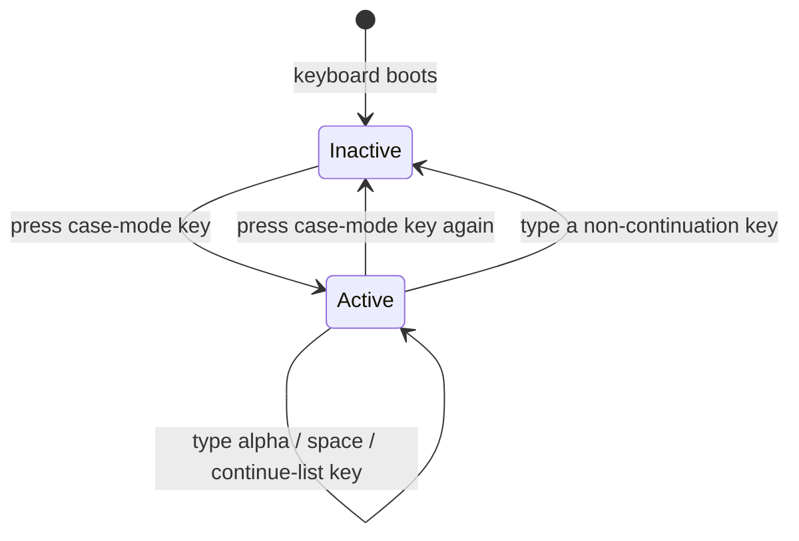
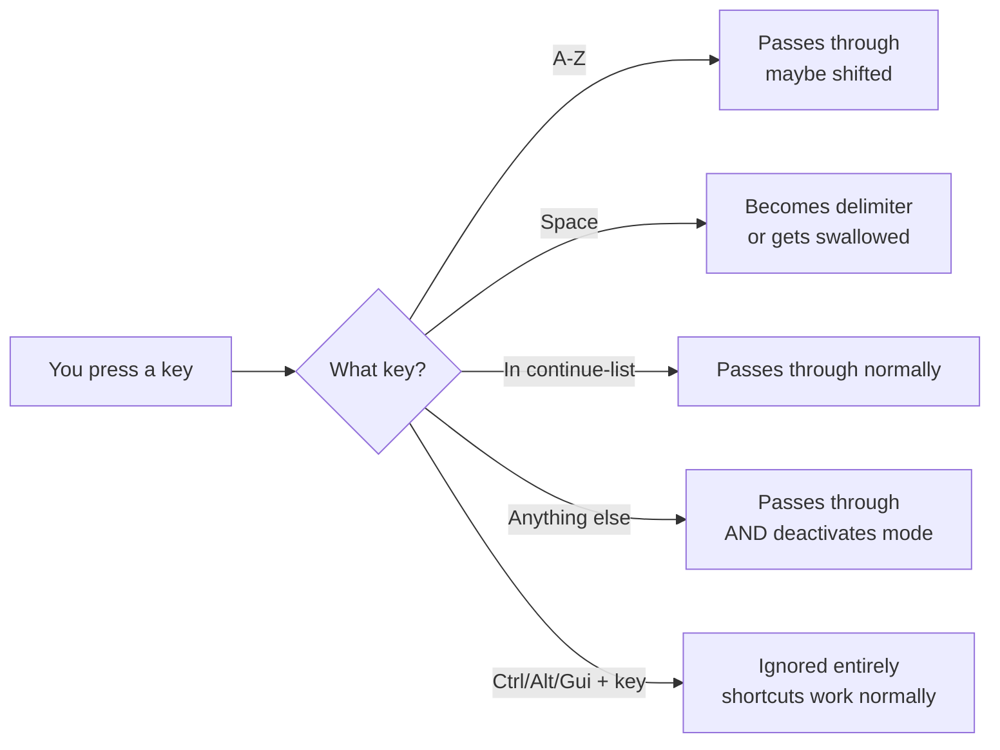
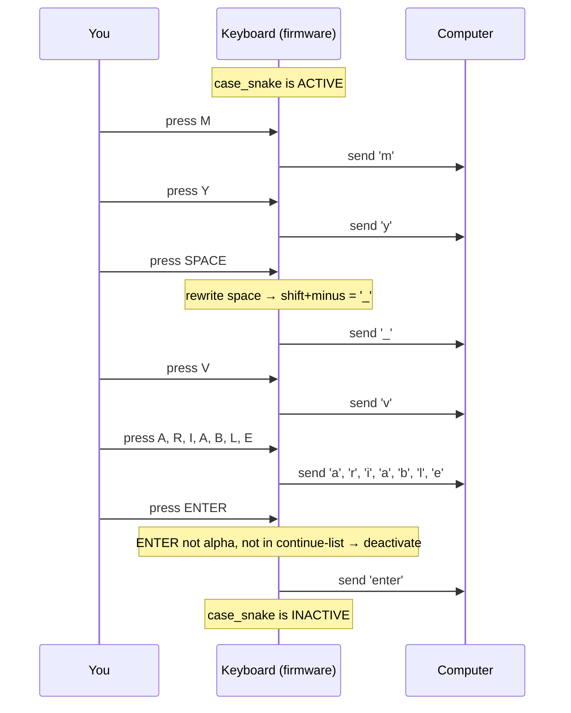
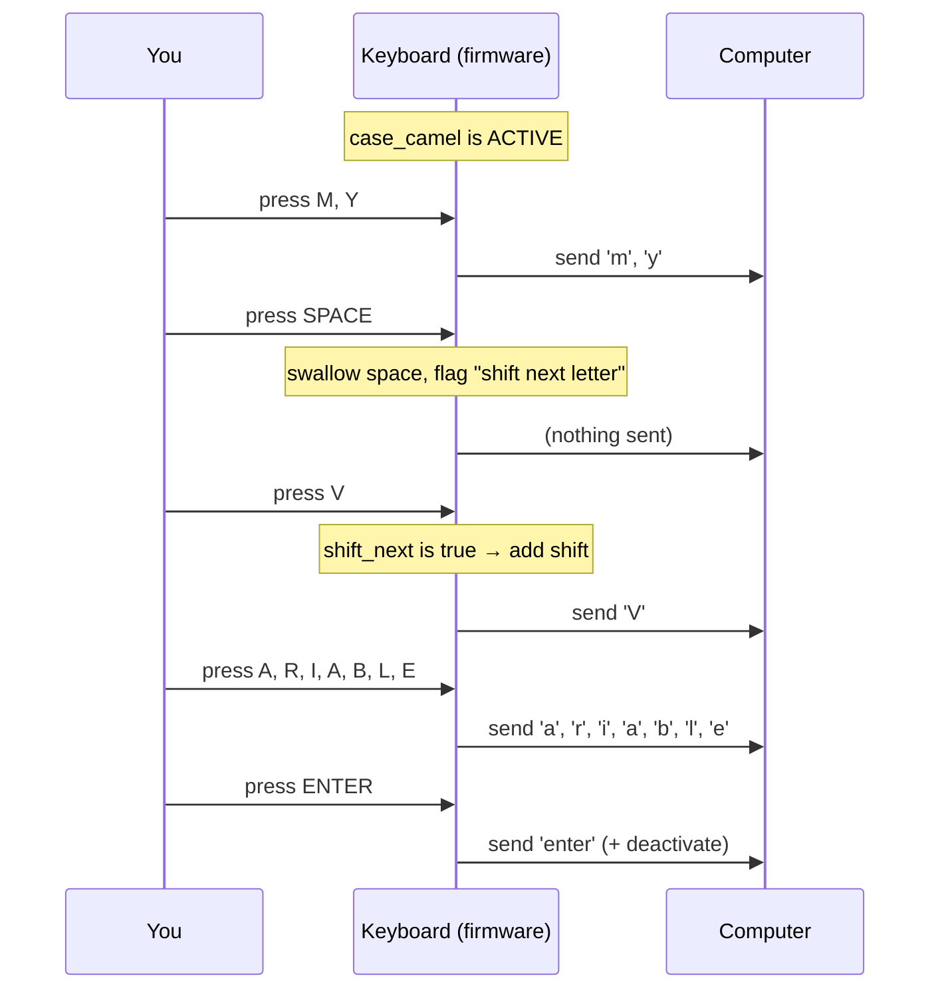
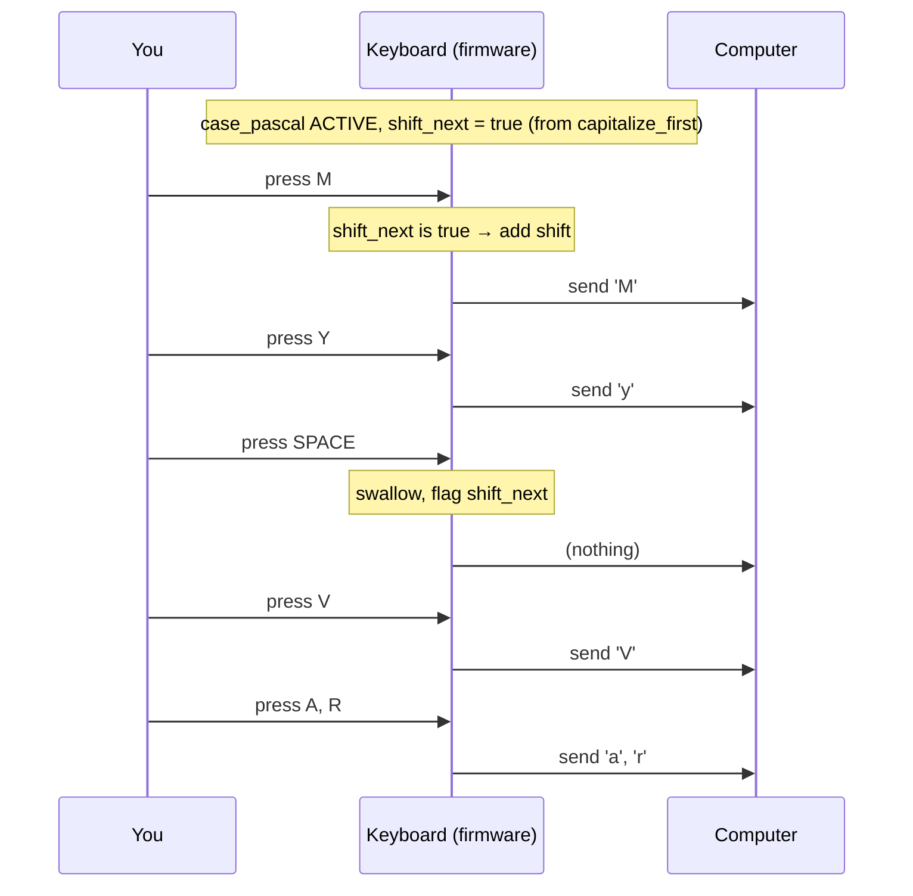
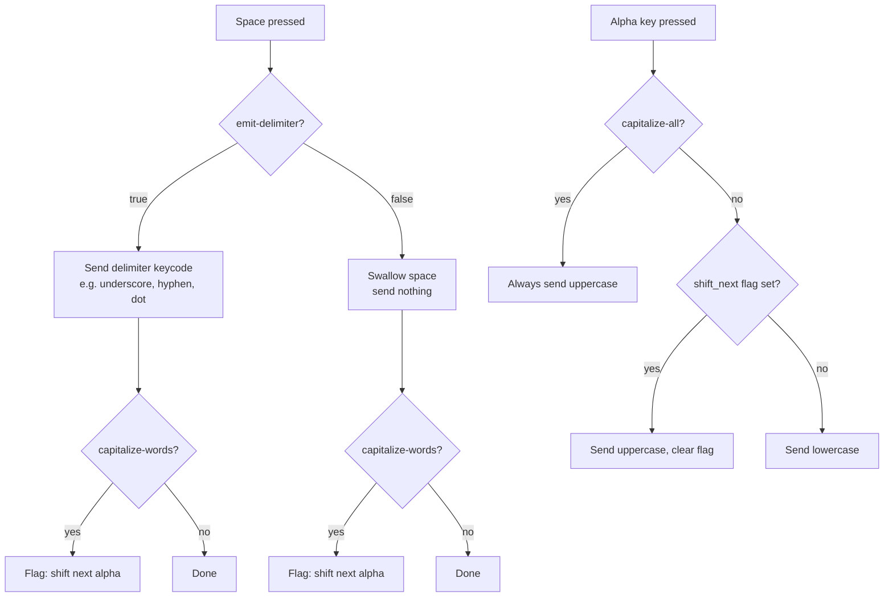

# How Case Mode Works

A high-level explanation of the mental model — no C knowledge required.

## The Core Idea

You press a key to enter a "mode." While in that mode, your spacebar does something different. When you're done, the mode turns off.



## What Happens to Each Key

While case mode is active:



## Example: Typing `my_variable` in Snake Case



Result: `my_variable` + enter, and you're back to normal typing.

## Example: Typing `myVariable` in Camel Case



Result: `myVariable` + enter.

## Example: Typing `MyVariable` in Pascal Case

Same as camelCase, but the very first letter is also shifted:



Result: `MyVar...`

## The Properties — What They Control



## Exiting Case Mode

Three ways out:

| Method                    | What happens                                                                 |
| ------------------------- | ---------------------------------------------------------------------------- |
| **Toggle key**            | Press the same binding again. Clean, explicit.                               |
| **Non-continuation key**  | Type anything not in alpha/continue-list. It passes through AND deactivates. |
| **Activate another mode** | Pressing a different case-mode binding deactivates the current one.          |

The toggle key is the recommended "I'm done" action. The non-continuation exit is a safety net so you don't get stuck.

## What Stays Active (Continue-List)

By default, only A-Z keeps the mode alive. Everything else exits.

If you want numbers, backspace, or other keys to NOT exit the mode, add them to `continue-list`:

```
continue-list = <N1 N2 N3 N4 N5 N6 N7 N8 N9 N0 BACKSPACE DELETE>;
```

The pre-defined behaviors (`&case_snake`, etc.) already include numbers.
